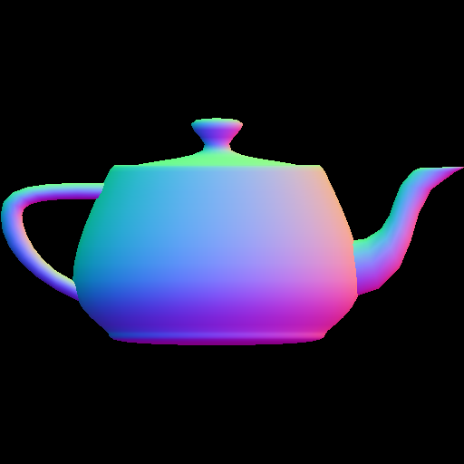

# Rasterizer

# Description:
This rasterizer was implemented from scratch, however it utilizes the CPU instead of the GPU. It reads from an obj file all the vertex data and then it scales and fits all the vertices into the window screen (it does not output anything directly to the screen). Then it calculates the color using barycentric coordinates and saves the output image to a file. There are 7 different task which each have a different output, check them out!

# Usage:

command line arguments example:

../resources/bunny.obj output.png 512 512 1

where ../resources/bunny.obj is the obj file converted to image

where output.png is the output png file

where 512 and 512 are the width and height of the output

1 is the number of the task (it could be from 1 to 7)
